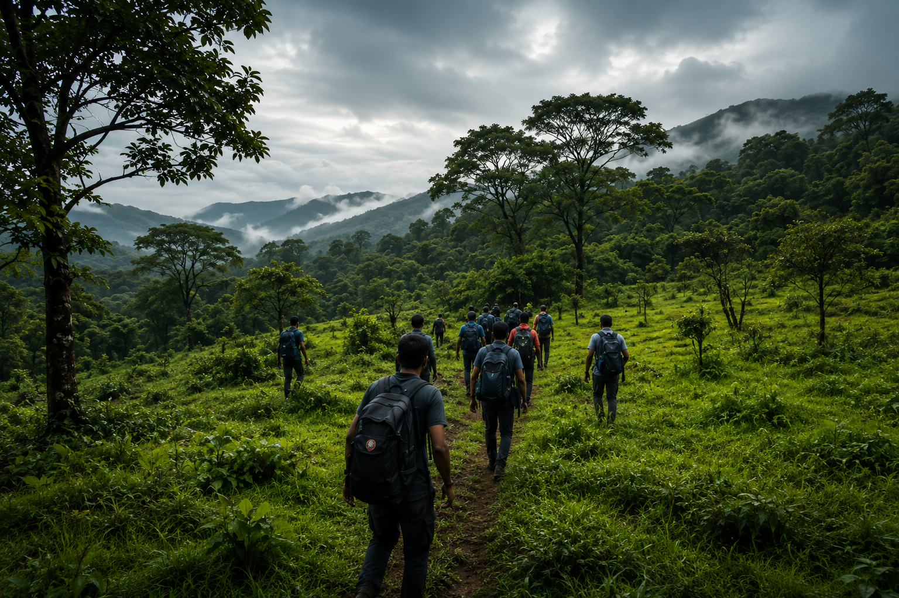
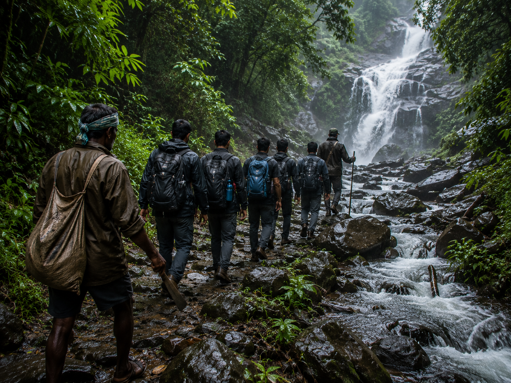
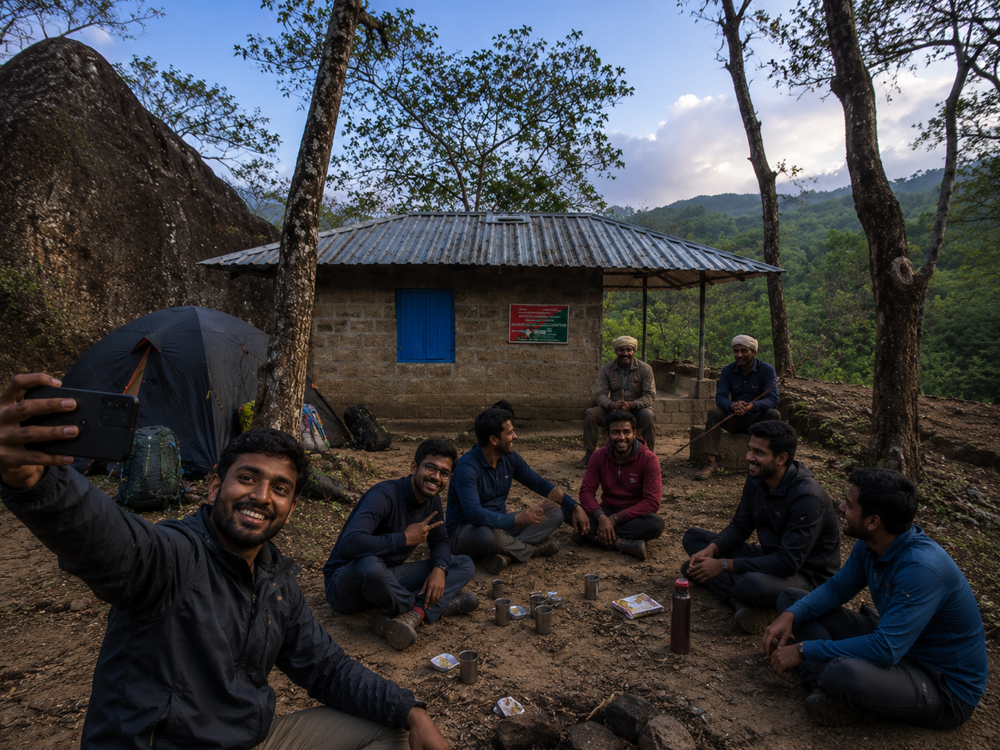

# **അഗസ്ത്യാർകൂടം – ഒരു യാത്ര**

ചില യാത്രകൾ ലക്ഷ്യസ്ഥാനങ്ങൾ കാണാൻ വേണ്ടിയുള്ളതല്ല. ജീവിതത്തെ മറ്റൊരു കാഴ്ചപ്പാടിലൂടെ അനുഭവിക്കാൻ വേണ്ടിയുള്ളതാണ്. അഗസ്ത്യാർകൂടത്തിലേക്കുള്ള എന്റെ യാത്ര അങ്ങനെയൊന്നായിരുന്നു. ഇന്നും കണ്ണടച്ചാൽ ആ കാടിന്റെ നിശ്ശബ്ദതയും, മഴയുടെ തണുപ്പും,  അതിനുള്ളിൽ ഒളിഞ്ഞിരുന്ന ഭയവും ഒരുപോലെ മനസ്സിലേക്ക് ഒഴുകിയെത്തും.

വേനൽക്കാലം വിടപറഞ്ഞ് മഴയുടെ വരവറിയിച്ച് കാർമേഘങ്ങൾ മലഞ്ചെരിവുകളെ പുതച്ചുതുടങ്ങിയ ദിവസങ്ങൾ. സഞ്ചാരികൾ വിരളമായ ഓഫ് സീസൺ. അങ്ങനെയൊരു രാവിലെയാണ് ഞാനും എന്റെ  സുഹൃത്തുക്കളും രണ്ട് ഗൈഡുമാരും ചേർന്ന് അഗസ്ത്യാർകൂടം ലക്ഷ്യമാക്കി യാത്ര തിരിച്ചത്.

# അധ്യായം 1 : യാത്രയുടെ ആരംഭം

യാത്രയുടെ ആരംഭം  ഞങ്ങളെ വരവേറ്റത് കാടിന്റെ ഗംഭീരമായ നിശ്ശബ്ദതയായിരുന്നു. എന്നാൽ ഓരോ ഇലയും, കാറ്റും, വനത്തിന്റെ  സാന്നിധ്യം ഞങ്ങളെ അനുഭവിപ്പിച്ചു. ഓഫ് സീസൺ ആയതിനാൽ ആ വനത്തിൽ മനുഷ്യരുടെ സാന്നിധ്യമായി ഞങ്ങൾ മാത്രമേ ഉണ്ടായിരുന്നുള്ളൂ.

യാത്രയുടെ ആദ്യഭാഗം അഗസ്ത്യാർകൂടത്തിന്റെ പ്രത്യേകതയായ മൊട്ടക്കുന്നുകളും വിശാലമായ പുൽമേടുകളും നിറഞ്ഞ ഭൂപ്രദേശത്തിലൂടെയായിരുന്നു. തണുത്ത കാറ്റും കണ്ണെത്താദൂരത്തോളം വിരിഞ്ഞ പച്ചപ്പും മനസ്സിനെ വല്ലാതെ ആകർഷിച്ചു. എന്നാൽ ഓരോ ചുവടും മുന്നോട്ട് വെച്ചതോടെ ഭൂപ്രകൃതിയും മാറിത്തുടങ്ങി. തുറന്ന പുൽമേടുകൾ പതിയെ അപ്രത്യക്ഷമായി. അവയ്ക്കു പകരം സൂര്യപ്രകാശം പോലും പ്രയാസപ്പെട്ട് കടന്നുവരുന്ന ഇടതൂർന്ന മഴക്കാടാണ് ഞങ്ങളെ വരവേറ്റത്.

ഓരോ നിമിഷവും കാട് പുതിയ അത്ഭുതങ്ങൾ സമ്മാനിച്ചുകൊണ്ടിരുന്നു. പെട്ടെന്ന് മുന്നിൽ ഒരു വലിയ അണലി. കുറച്ചുനേരം ഞങ്ങൾ അതിനെ നോക്കിനിന്നു. പിന്നീട് സുരക്ഷിതമായ അകലം പാലിച്ചു ഞങ്ങൾ യാത്ര തുടർന്നു.

ഓരോ കാഴ്ചയും ജീവിതത്തിലെ ആദ്യ അനുഭവങ്ങളായിരുന്നു. ചിത്രങ്ങളിൽ മാത്രം കണ്ടിട്ടുള്ള അപൂർവ സസ്യങ്ങൾ... വിചിത്ര രൂപങ്ങളിലുള്ള കൂണുകൾ... നിറങ്ങളുടെ ഉത്സവം തീർത്ത പൂമ്പാറ്റകൾ... പ്രകൃതി ഇത്രയും വൈവിധ്യമാർന്നതാണെന്ന് അപ്പോഴാണ് യഥാർത്ഥത്തിൽ മനസ്സിലായത്. വനത്തിന്റെ യഥാർത്ഥ ലോകം ഓരോ ചുവടിലും ഞങ്ങളുടെ മുന്നിൽ തുറന്നുവരികയായിരുന്നു.

വഴിയിലുടനീളം ചെറു അരുവികളും വെള്ളച്ചാട്ടങ്ങളും. അവയിൽ ഒരു വെള്ളച്ചാട്ടത്തിൽ ഞങ്ങൾ കുളിച്ചു. പാറകളിലൂടെ പതിച്ചിറങ്ങുന്ന തണുത്ത വെള്ളം ശരീരത്തെയും മനസ്സിനെയും ഒരുപോലെ ഉണർത്തി. യാത്രയുടെ ക്ഷീണം അറിയാതെ ഓരോ കാഴ്ചകളും ആസ്വദിച്ചുകൊണ്ട് വൈകുന്നേരത്തോടെ ഞങ്ങൾ അതിരുമല ബേസ് ക്യാമ്പിലെത്തി.

കാടിന്റെ നടുവിലുള്ള ലളിതമായ ഒരു ബേസ് ക്യാമ്പായിരുന്നു അത്. വന്യമൃഗങ്ങൾ രാത്രിയിൽ അകത്തേക്ക് കടക്കാതിരിക്കാൻ ക്യാമ്പിന് ചുറ്റുമായി ഒരു കിടങ്ങ് ഒരുക്കിയിരുന്നു. പ്രകൃതിയോട് ഏറ്റവും അടുത്ത്, എല്ലാ സൗന്ദര്യവും വന്യതയും അടുത്തറിയാൻ കഴിയുന്ന  ആ താമസസ്ഥലം ഞങ്ങൾക്ക് പുതുമയുള്ളൊരു അനുഭവമായിരുന്നു.

സൂര്യൻ മലകൾക്കപ്പുറം മറഞ്ഞതോടെ വനവും പതിയെ മറ്റൊരു രൂപം കൈക്കൊണ്ടു. പകൽ കണ്ട അതേ കാട് രാത്രിയിൽ ദുരൂഹത നിറഞ്ഞ മറ്റൊരു ലോകമായി മാറി. ചുറ്റും കനത്ത ഇരുട്ട്. ക്യാമ്പിൽ ആകെ ഉണ്ടായിരുന്നത് സൗരോർജത്തിൽ പ്രവർത്തിക്കുന്ന ഏതാനും മങ്ങിയ വവിളക്കുകളും ഏതാനും മണ്ണെണ്ണ വിളക്കുകളും ആയിരുന്നു. ആ മങ്ങിയ വെളിച്ചത്തിനപ്പുറം കാട് മുഴുവൻ ഇരുട്ടിൽ മുങ്ങിക്കിടന്നു. ദൂരെയെവിടെയോ നിന്ന് കേൾക്കുന്ന വന്യമൃഗങ്ങളുടെ ശബ്ദം മനസ്സിൽ അജ്ഞാതമായൊരു ഭയം നിറച്ചു. ഓഫ് സീസൺ ആയതിനാൽ ഞങ്ങളും രണ്ട് ഗൈഡുമാരും അവിടെയുണ്ടായിരുന്ന ഏതാനും ജീവനക്കാരും മാത്രമായിരുന്നു ആ വനത്തിൽ.

ഭക്ഷണം പാകം ചെയ്യാനുള്ള സാധനങ്ങൾ ഞങ്ങൾ തന്നെയായിരുന്നു കൊണ്ടുവന്നത്. അവിടുത്തെ ജീവനക്കാർ ഞങ്ങൾക്കും ചേർത്തു ഭക്ഷണം തയാറാക്കി. നല്ല വിശപ്പുണ്ടായിരുന്നതിനാൽ ചൂടോടെ കിട്ടിയ കഞ്ഞിയും സ്പെഷ്യൽ ചമ്മന്തിയും ജീവിതത്തിൽ കഴിച്ച ഏറ്റവും രുചികരമായ ഭക്ഷണങ്ങളിൽ ഒന്നായി ഇന്നും ഓർമ്മയിൽ നിൽക്കുന്നു. ആ കാട്ടിലെ തണുപ്പിലും നിശ്ശബ്ദതയിലും ആ ലളിതമായ ഭക്ഷണത്തിന് മറ്റൊരിടത്തും കിട്ടാത്ത രുചിയുണ്ടായിരുന്നു.

വവൈകിട്ട് ഏഴുമണിയോടെ ക്യാമ്പിന് മുന്നിൽ തീ കൂട്ടി. അതിന് ചുറ്റും ഞങ്ങൾ വിശ്രമിക്കുകയും വിശേഷങ്ങൾ പങ്കുവെക്കുകയും ചെയ്തു.  അത്താഴത്തിനുശേഷം ഞങ്ങൾ ഉറങ്ങാൻ കിടന്നു. എന്നാൽ കൊടും വനത്തിലെ ഉറക്കം അത്ര എളുപ്പമായിരുന്നില്ല. കാട്ടിലെ ഓരോ ശബ്ദവും ഉറക്കത്തെ ഇടയ്ക്കിടെ മുറിച്ചുണർത്തി. അപ്പോഴാണ് മനസ്സിലായത് — കാട് ഒരിക്കലും ഉറങ്ങുന്നില്ല; ഉറങ്ങിയത് ഞങ്ങൾ മാത്രമായിരുന്നു.

# അധ്യായം 2 : മേഘങ്ങൾക്കുമുകളിൽ ഒരു പ്രഭാതം
പിറ്റേന്ന് അതിരാവിലെ ഞങ്ങളെ കാത്തിരുന്നത് മേഘങ്ങൾക്കുമുകളിലെ ഒരു പ്രഭാതം , അത് ജീവിതത്തിലെ ഏറ്റവും മനോഹരമായ അനുഭവങ്ങളിലൊന്നായിരുന്നു. എന്നാൽ അതേ ദിവസം വൈകുന്നേരം ആ യാത്ര ജീവിതത്തിലെ ഏറ്റവും കഠിനമായ പരീക്ഷണമായി മാറുമെന്ന് അപ്പോൾ ഞങ്ങളിൽ ആരും അറിഞ്ഞിരുന്നില്ല.

തണുപ്പും വന്യമൃഗങ്ങളുടെ ശബ്ദങ്ങളും പിന്നിലാക്കി അതിരാവിലെ ഞങ്ങൾ വീണ്ടും യാത്ര തുടങ്ങി. ലക്ഷ്യം അഗസ്ത്യാർകൂടത്തിന്റെ കൊടുമുടി. കാട്ടിലൂടെ നടന്ന് ആദ്യദിവസം തന്നെ പ്രകൃതിയുടെ പല മുഖങ്ങളും കണ്ടിരുന്നെങ്കിലും ആ ദിവസമാണ് അഗസ്ത്യാർകൂടം തന്റെ യഥാർത്ഥ ഭംഗി ഞങ്ങൾക്ക് കാണിച്ചുതന്നത്.

ആദ്യമൊക്കെ വഴി താരതമ്യേന എളുപ്പമായിരുന്നു. പക്ഷേ ഉയരം കൂടുന്തോറും കയറ്റവും കഠിനമായി. വഴുവഴുപ്പുള്ള പാറകൾ...  ഇടുങ്ങിയ വഴികൾ... ഓരോ ചുവടും ശ്രദ്ധയോടെ മാത്രം മുന്നോട്ട് വയ്ക്കേണ്ട അവസ്ഥ. ചെറിയൊരു അശ്രദ്ധ പോലും അപകടത്തിലേക്ക് നയിക്കാമായിരുന്നു.

എന്നാൽ ഓരോ കയറ്റത്തിനും പ്രതിഫലമായി പ്രകൃതി അതിലും മനോഹരമായ കാഴ്ചകൾ സമ്മാനിച്ചുകൊണ്ടിരുന്നു.

ഒടുവിൽ ഞങ്ങൾ അഗസ്ത്യാർകൂടത്തിന്റെ കൊടുമുടിയിലെത്തി.

ആ നിമിഷം ഇന്നും മനസ്സിൽ അതേ തെളിച്ചത്തോടെ നിലനിൽക്കുന്നു.

ചുറ്റും അനന്തമായി പരന്നുകിടക്കുന്ന പശ്ചിമഘട്ട മലനിരകൾ... പച്ചപ്പിന്റെ സമുദ്രംപോലെ തോന്നിക്കുന്ന വനങ്ങൾ... താഴെ മേഘങ്ങൾ പതിയെ ഒഴുകിനീങ്ങുന്ന കാഴ്ച... കുറച്ചുനേരത്തേക്ക് സമയം തന്നെ നിശ്ചലമായതുപോലെ തോന്നി. അത് ഒരു കൊടുമുടി മാത്രമായിരുന്നില്ല; പ്രകൃതിയുടെ വിശാലതയ്ക്കുമുന്നിൽ മനുഷ്യൻ എത്ര ചെറുതാണെന്ന് തിരിച്ചറിയുന്ന ഒരിടം കൂടിയായിരുന്നു.

അവിടെ ചെലവഴിച്ച ഓരോ നിമിഷവും മനസ്സിൽ പതിഞ്ഞു. ആ ഉയരത്തിൽ നിന്നുള്ള തണുത്ത കാറ്റ് മുഖത്ത് തട്ടുമ്പോൾ, മണിക്കൂറുകളോളം നടന്നതിന്റെ ക്ഷീണം പോലും മറന്നുപോയിരുന്നു.

തതിരിച്ചിറങ്ങുമ്പോൾ, ഉച്ചസമയമായിട്ടും സൂര്യപ്രകാശം നിലത്ത് എത്താത്ത ഒരു വനഭാഗത്തിലൂടെയാണ് ഞങ്ങൾ നടന്നത്. അത്രയ്ക്കും ഇടതൂർന്ന് വളർന്ന മരങ്ങൾ. താഴെ എപ്പോഴും ഈർപ്പം നിറഞ്ഞ മണ്ണ്. വായുവിൽ നിറഞ്ഞുനിന്ന ആർദ്രതയും തണുപ്പും ആ വനത്തിന് ഒരു പ്രത്യേക ഭാവം നൽകി. അവിടത്തെ നിശ്ശബ്ദത മറ്റൊരു ലോകത്തേക്ക് കടന്നതുപോലുള്ള അനുഭവമായിരുന്നു.

ആ ദിവസം കാലാവസ്ഥ ഓരോ നിമിഷവും മാറിക്കൊണ്ടിരുന്നു. ഒരു നിമിഷം കൊടുംമഞ്ഞ് എല്ലാം മറയ്ക്കും. അടുത്ത നിമിഷം മഴ പെയ്തിറങ്ങും. പിന്നെ പെട്ടെന്ന് ആകാശം തെളിയും. ഏതാനും മിനിറ്റുകൾക്കുള്ളിൽ വീണ്ടും മേഘങ്ങൾ എത്തും. അഗസ്ത്യാർകൂടത്തിന്റെ പ്രകൃതി ഒരേ മുഖം ഒരിക്കലും അധികനേരം കാണിക്കില്ലെന്ന് അപ്പോഴാണ് മനസ്സിലായത്.

ഉച്ചയോടെ ഞങ്ങൾ വീണ്ടും ബേസ് ക്യാമ്പിലെത്തി. അവിടെ ഞങ്ങളെ കാത്തിരുന്നത് ചൂടുള്ള ഉച്ചഭക്ഷണവുമായിരുന്നു. മണിക്കൂറുകളോളം നടന്നെത്തിയ ഞങ്ങൾക്ക് ആ ഭക്ഷണം ഒരു വിരുന്നുപോലെയായിരുന്നു.

ഭക്ഷണത്തിനുശേഷം അദ്ദേഹം അന്നത്തെ രാത്രി കൂടി അവിടെ തങ്ങാൻ അവിടുത്തെ ജീവനക്കാരൻ നിർദ്ദേശിച്ചു. പക്ഷേ അന്നുതന്നെ മലയിറങ്ങേണ്ട വ്യക്തിപരമായ സാഹചര്യം ഞങ്ങൾക്കുണ്ടായിരുന്നു. അതുകൊണ്ട് കുറച്ചുനേരം വിശ്രമിച്ച ശേഷം ഉച്ചയോടെ തിരിച്ചുള്ള യാത്ര ആരംഭിക്കാൻ ഞങ്ങൾ തീരുമാനിച്ചു. ആ തീരുമാനത്തോടെയാണ് ഞങ്ങളുടെ ജീവിതത്തിലെ ഏറ്റവും കഠിനമായ അധ്യായം ആരംഭിച്ചത്.

# അധ്യായം 3 : കാടിന്റെ രൗദ്രഭാവം 
ഉച്ചകഴിഞ്ഞ് ഞങ്ങൾ മലയിറങ്ങാൻ തുടങ്ങി. കഴിഞ്ഞ ദിവസം വിസ്മയത്തോടെ കയറിയ അതേ വഴിയിലൂടെയായിരുന്നു മടക്കം. ഇറക്കം ആയതുകൊണ്ട് യാത്ര വേഗത്തിൽ പൂർത്തിയാക്കാമെന്നായിരുന്നു ഞങ്ങളുടെ പ്രതീക്ഷ.

ആദ്യത്തെ കുറച്ചുസമയം എല്ലാം സാധാരണമായിരുന്നു.

നടന്നുകൊണ്ടിരിക്കെ ദൂരെയായി കറുത്ത കാർമേഘങ്ങൾ ഉരുണ്ടു കയറുന്നത് കണ്ടു. ആദ്യം അത് മനോഹരമായൊരു കാഴ്ചയായി തോന്നി. മലമുകളെ പതിയെ വിഴുങ്ങിക്കൊണ്ട് മേഘങ്ങൾ നീങ്ങിവരുന്നത് പ്രകൃതിയുടെ മറ്റൊരു ഭംഗിയായി ഞങ്ങൾ ആസ്വദിച്ചു.

അൽപസമയത്തിനുശേഷം മഴത്തുള്ളികൾ വീണുതുടങ്ങി.

തുടക്കത്തിൽ അത് യാത്രയ്ക്ക് കൂടുതൽ ഭംഗി കൂട്ടുന്നതുപോലെയായിരുന്നു. മഴ നനഞ്ഞ കാട്ടിലൂടെ നടക്കുന്നത് എല്ലാവരും ആസ്വദിച്ചു. എന്നാൽ ആ സന്തോഷം അധികനേരം നീണ്ടുനിന്നില്ല.

ഏതാനും നിമിഷങ്ങൾക്കകം മഴ അതിന്റെ യഥാർത്ഥ ഭാവം പുറത്തെടുത്തു.

കണ്ണുതുറന്ന് മുന്നോട്ട് നോക്കാൻ പോലും പ്രയാസപ്പെടുന്നത്ര ശക്തിയായി മഴ പെയ്തു. നിമിഷങ്ങൾക്കുള്ളിൽ വഴികൾ ചെറിയ അരുവികളായി മാറി. മണ്ണ് മുഴുവൻ വഴുവഴുപ്പായി. ഓരോ ചുവടും സൂക്ഷിച്ചുവെക്കേണ്ട അവസ്ഥ.

മഴയിൽ നനഞ്ഞ കാട് ഏതാനും മിനിറ്റുകൾക്കുള്ളിൽ മറ്റൊരു ലോകമായി മാറുകയായിരുന്നു.

കാട്ടാന ആക്രമണം കാരണം വൈകുന്നേരം നാല് മണിക്ക് മുമ്പ് കാടിന് പുറത്തുകടക്കണമെന്നത് കർശനമായ നിർദേശമുണ്ടായിരുന്നു . അതിന് ശേഷം വനത്തിൽ തുടരുന്നത് സുരക്ഷിതമല്ല. മഴ കാരണം ഞങ്ങളുടെ യാത്രയുടെ വേഗത കുറഞ്ഞു. സമയം അതിവേഗം മുന്നോട്ടുപോകുമ്പോൾ ഞങ്ങളുടെ ചുവടുകൾ മന്ദഗതിയിലായി.

വഴിയിൽ രണ്ട് പുഴകൾ കടക്കേണ്ടതുണ്ടായിരുന്നു.

ആദ്യത്തെ പുഴ  ഞങ്ങൾ കടന്നുപോയി. പക്ഷേ രണ്ടാമത്തെ പുഴയിലെത്തിയപ്പോൾ ഞങ്ങൾ അക്ഷരാർത്ഥത്തിൽ നിശ്ചലരായി.

കഴിഞ്ഞ ദിവസം ശാന്തമായി ഒഴുകിയിരുന്ന അതേ പുഴ ഇപ്പോൾ പ്രക്ഷുബ്ധമായി കുതിക്കുകയായിരുന്നു. മലവെള്ളം അതിന്റെ ഒഴുക്കിനെ ഭയാനകമാക്കിയിരുന്നു. ഒരു കാൽ വഴുതിയാൽ താഴെയുള്ള വലിയ വെള്ളച്ചാട്ടത്തിലേക്ക് പതിക്കുമെന്നുറപ്പ്. ചെറിയൊരു പിഴവ് പോലും അപകടകരമായേക്കാവുന്ന സാഹചര്യം.

ഞങ്ങൾ മുഖത്തോട് മുഖം നോക്കി.

എന്ത് ചെയ്യണമെന്നറിയാതെ ഗൈഡുമാരും കുറച്ചുനേരം മിണ്ടാതിരുന്നു. അവരുടെ മുഖത്തും ആശങ്ക വ്യക്തമായിരുന്നു.

ഒടുവിൽ എല്ലാവരും ചേർന്ന് ആലോചിച്ചശേഷം ഒരു തീരുമാനം എടുത്തു.

അടുത്തുള്ള ഒരു ആദിവാസി കോളനിയിലേക്ക് പോയി ആ രാത്രി അവിടെ തങ്ങാം. പുലർച്ചെ വെള്ളത്തിന്റെ ഒഴുക്ക് കുറഞ്ഞശേഷം യാത്ര തുടരാം.

ആ തീരുമാനം അപ്പോൾ ഞങ്ങൾക്ക് വലിയൊരു ആശ്വാസമായി തോന്നി.

പക്ഷേ പ്രതീക്ഷ അധികനേരം നിലനിന്നില്ല.

ആദിവാസി കോളനിയിലേക്കുള്ള വഴി തേടി മുന്നോട്ട് നടന്നുകൊണ്ടിരിക്കെ ഞങ്ങൾ എപ്പോഴോ വഴി തെറ്റിയിരുന്നു.

കുറച്ചുദൂരം പിന്നിട്ടപ്പോഴാണ് എന്തോ ശരിയല്ലെന്ന് തോന്നിയത്. വീണ്ടും വീണ്ടും വഴി പരിശോധിച്ചെങ്കിലും പരിചിതമായ അടയാളങ്ങളൊന്നും കാണാനില്ല. ഞങ്ങൾ വഴിതെറ്റിയെന്ന് പതിയെ തിരിച്ചറിഞ്ഞു.

സമയം വൈകുന്നേരം ആറരയോടടുത്തിരുന്നു. ശരിയായ വഴി കണ്ടെത്താൻ ഞങ്ങൾ പല ദിശകളിലായി നടന്നുനോക്കി. എന്നാൽ കനത്ത മഴയിൽ വഴിതെറ്റി ഞങ്ങൾ കാടിന്റെ ഉള്ളിലേക്ക് അകപ്പെട്ടുപോയി.

സമയം കഴിയുംതോറും കാട് ഇരുട്ടിന്റെ പുതപ്പണിഞ്ഞു.

പകൽ സൗമ്യമായി തോന്നിയ അതേ കാട് ഇപ്പോൾ അതിന്റെ രൗദ്ര ഭാവം കാണിച്ചുതുടങ്ങി.

ആ നിമിഷം മുതൽ ഞങ്ങളുടെ യാത്ര ഒരു സാധാരണ യാത്രയല്ലാതായി.

അത് ഒരു പോരാട്ടമായി മാറുകയായിരുന്നു.

# അധ്യായം 4 : കാട്ടിൽ കുടുങ്ങിയ രാത്രി

വഴിതെറ്റിയെന്ന് മനസ്സിലായ നിമിഷം മുതൽ ഞങ്ങളുടെ മനസ്സിലെ ആത്മവിശ്വാസം പതിയെ ഇല്ലാതാകാൻ തുടങ്ങി.

ഗൈഡുമാർ പലതവണ വഴി കണ്ടെത്താൻ ശ്രമിച്ചു. പക്ഷേ ഓരോ ദിശയും ഒരുപോലെ തോന്നി. മഴ മായ്ച്ചുകളഞ്ഞ കാൽപ്പാടുകളും ഇരുട്ടിൽ തിരിച്ചറിയാനാകാത്ത മരങ്ങളും മാത്രം. ഞങ്ങൾ നടന്നത് ശരിയായ വഴിയിലൂടെയാണോ, അതോ കൂടുതൽ അകത്തേക്കാണോ എന്നുപോലും ആർക്കും ഉറപ്പില്ലായിരുന്നു.

സമയം ഏഴുമണിയോട് അടുക്കുകയായിരുന്നു.

ഇരുട്ട് കാട്ടിനെ പൂർണമായി വിഴുങ്ങിക്കഴിഞ്ഞിരുന്നു. തലേദിവസം കൗതുകത്തോടെ കണ്ട പാമ്പുകളും വന്യമൃഗങ്ങളെക്കുറിച്ച് ഗൈഡുമാർ പറഞ്ഞ കഥകളും ഓരോരുത്തരുടെയും മനസ്സിൽ ഭീതി നിറച്ചു.  ഞങ്ങളുടെ ഗൈഡിന്റെ മുഖത്തുപോലും ആത്മവിശ്വാസം നഷ്ടപ്പെട്ടതായി തോന്നി. അതുവരെ ഞങ്ങൾക്ക് ധൈര്യം പകർന്നിരുന്ന ആളും നിശ്ശബ്ദനായിരുന്നു.

കുറച്ചുസമയം ഒരു ഗുഹയിൽ അഭയം തേടാമെന്ന് ഞങ്ങൾ നിർദ്ദേശിച്ചു. പക്ഷേ അത് അതിലും അപകടകരമാണെന്ന് ഗൈഡ് പറഞ്ഞു. രാത്രിയിൽ വന്യമൃഗങ്ങൾ അഭയം തേടുന്ന ഇടങ്ങളിൽ ഒന്നാണ് ഗുഹകൾ. അവിടെ കയറുക മറ്റൊരു അപകടം ക്ഷണിച്ചുവരുത്തുന്നതിന് തുല്യമായിരുന്നു.

മറ്റൊരു വഴിയുമില്ലാതെ ഞങ്ങൾ വീണ്ടും മുന്നോട്ട് നടന്നു.

ഓരോ ചുവടും ഭയത്തോടെയായിരുന്നു.

മുന്നോട്ട് നടക്കുന്നതിനിടെ ഒരു വലിയ പാറയാണെന്ന് കരുതി ഞങ്ങൾ അതിനടുത്തെത്തി. എന്നാൽ ഏതാനും നിമിഷങ്ങൾക്കകം അത് ഒരു കാട്ടാനയാണെന്ന് തിരിച്ചറിഞ്ഞു. അതിന്റെ ചിന്നംവിളി കാട്ടിൽ മുഴങ്ങിയതോടെ മറ്റൊന്നും ആലോചിക്കാൻ സമയമുണ്ടായിരുന്നില്ല. ജീവൻ രക്ഷിക്കാനുള്ള ഓട്ടമായിരുന്നു പിന്നെ. എത്ര നേരം ആ ഓട്ടം  തുടർന്നു  അറിയില്ല.

രാവിലെ മുതൽ തുടർച്ചയായി അലഞ്ഞതിന്റെ ക്ഷീണം ശരീരത്തെ തളർത്തിയിരുന്നു. കാലുകൾ മുറിഞ്ഞ് രക്തം വാർന്നുകൊണ്ടിരുന്നു. പക്ഷേ അപ്പോഴൊന്നും ആ വേദന ഞങ്ങൾ അറിഞ്ഞില്ല. അവിടെനിന്ന് പുറത്തുകടക്കുക എന്നൊരു ചിന്ത മാത്രമായിരുന്നു മനസ്സിൽ.

അങ്ങനെ മുന്നോട്ട് പോകുന്നതിനിടയിലാണ് ഒരു അരുവി കണ്ടത്. അതിന്റെ ഒഴുക്കിനെ പിന്തുടർന്ന് നടന്നാൽ മനുഷ്യവാസമുള്ള ഏതെങ്കിലും സ്ഥലത്തെത്താമെന്ന പ്രതീക്ഷയിൽ ഞങ്ങൾ അതിന്റെ ദിശയിലേക്ക് നീങ്ങി.

കുറച്ചുദൂരം പിന്നിട്ടപ്പോൾ ഒരു ജലാശയത്തിന്റെ കരയിലെത്തി.

അവിടെവച്ച് ഞങ്ങൾ വീണ്ടും കുടുങ്ങി. മുന്നോട്ട് പോകാൻ വഴിയില്ല. തിരികെ പോകാൻ ധൈര്യവുമില്ല. ചുറ്റും വന്യമൃഗങ്ങളുടെ ആവാസകേന്ദ്രമായ കാട്. മഴ അപ്പോഴും ശമിച്ചിരുന്നില്ല.

എന്ത് ചെയ്യണമെന്ന് അറിയാതെ ഞങ്ങൾ അവിടെ നിന്നു. മൊബൈൽ നെറ്റ്‌വർക്ക് കിട്ടുമോ എന്നൊക്കെ എല്ലാവരം മാറി മാറി ശ്രമിച്ചെങ്കിലും എല്ലാം വിഫലമായി. പെട്ടെന്നാണ് അങ്ങകലെ ഒരു ചെറിയ വെളിച്ചം മിന്നിമറയുന്നത് പോലെ ഞങ്ങളുടെ ശ്രദ്ധയിൽപ്പെട്ടത്. ആദ്യം അത് എന്റെ തോന്നലാണെന്ന് കരുതി. പക്ഷെ എല്ലാവരും അത് കണ്ടു.

ഞങ്ങൾ ഉറക്കെ വിളിച്ചു.

പ്രതികരണമൊന്നും ഉണ്ടായില്ല.

നിരാശയോടെ വീണ്ടും എന്തൊക്കെയോ ശ്രമിച്ചുകൊണ്ട് സമയം തള്ളി നീക്കി.

കുറച്ചുസമയം കഴിഞ്ഞപ്പോൾ വീണ്ടും അതേ വെളിച്ചം.

ഇത്തവണ അത് പതിയെ ഞങ്ങളുടെ അടുത്തേക്ക് വരുന്നതായി തോന്നി.

പ്രതീക്ഷയും സംശയവും ഒരുപോലെ മനസ്സിൽ നിറഞ്ഞു. വീണ്ടും എല്ലാവരും ചേർന്ന് ഉറക്കെ വിളിച്ചു. ഞങ്ങളുടെ ശബ്ദം കാട്ടിലെ നിശ്ശബ്ദത കീറിമുറിച്ചുകൊണ്ട് ദൂരേക്ക് പാഞ്ഞു.

അൽപസമയത്തിനുശേഷം ഇരുട്ടിനുള്ളിൽ നിന്ന് ഒരു ചെറിയ വള്ളം ഞങ്ങളുടെ അരികിലേക്ക് എത്തി.

ആ നിമിഷം ഞങ്ങൾക്ക് മുന്നിൽ തെളിഞ്ഞത് ഒരു വള്ളം മാത്രമായിരുന്നില്ല...അത് ഒരു പ്രതീക്ഷ കൂടിയായിരുന്നു .

# അധ്യായം 5 : ഇരുട്ടിലെ വെളിച്ചം

വഴിതെറ്റി മണിക്കൂറുകളായി കാട്ടിൽ കുടുങ്ങിക്കിടക്കുകയാണെന്ന് കേട്ടപ്പോൾ അവർ സ്ഥിതിഗതികളുടെ ഗൗരവം പെട്ടെന്ന് തിരിച്ചറിഞ്ഞു.

"ഇത് വളരെ അപകടം പിടിച്ച സ്ഥലമാണ്. ആനകൾ സ്ഥിരമായി ഇറങ്ങുന്ന വഴിയാണ്. ഇവിടെ നിൽക്കുന്നതുപോലും സുരക്ഷിതമല്ല," അവരിലൊരാൾ പറഞ്ഞു.

പക്ഷേ അവർ വന്നത് ചെറിയൊരു വള്ളത്തിലായിരുന്നു. ഞങ്ങളുടെ മുഴുവൻ സംഘത്തെയും ഒരുമിച്ച് അതിൽ കയറ്റാൻ കഴിയില്ലായിരുന്നു. അതിന് പുറമെ വന്യമൃഗങ്ങൾ സഞ്ചരിക്കുന്ന പ്രദേശമായതിനാൽ വള്ളം കരയോട് ചേർത്ത് നിർത്തുന്നതും അപകടകരമായിരുന്നു. ഞങ്ങളെ സഹായിക്കാനുള്ള മനസ്സുണ്ടായിരുന്നെങ്കിലും സാഹചര്യങ്ങൾ അതിന് അനുകൂലമായിരുന്നില്ല.

അപ്പോഴാണ് അവർ മറ്റൊരു മാർഗം നിർദ്ദേശിച്ചത്.

അടുത്തുള്ള താരതമ്യേന സുരക്ഷിതമായ സ്ഥലത്തേക്ക് ഞങ്ങളെ എത്തിക്കാം. അവിടെ നിന്ന് ഫോറസ്റ്റ് ഓഫീസിൽ വിവരം അറിയിക്കാം. രക്ഷാസംഘം അവിടെ എത്തും.

പക്ഷേ ആ സുരക്ഷിത സ്ഥലത്തേക്കെത്താൻ കാട്ടിലൂടെ തന്നെ നടന്നു ഒരു നിറഞ്ഞൊഴുകുന്ന പുഴ കടക്കേണ്ടിവരുമായിരുന്നു. ഞങ്ങളുടെ കൂട്ടത്തിൽ ആർക്കും നീന്തൽ അറിയില്ലായിരുന്നു. അതുകൊണ്ട് ആ വഴി സ്വീകരിക്കാൻ ഞങ്ങൾ മടിച്ചു.

കുറച്ചുനേരം ആലോചിച്ച ശേഷം വള്ളത്തിലുണ്ടായിരുന്ന ഒരു ചെറുപ്പക്കാരൻ ധൈര്യം സംഭരിച്ച് വള്ളത്തിൽ നിന്ന് ഇറങ്ങി, വഴുക്കലുള്ള പാറകളും കുറ്റിച്ചെടികളും നിറഞ്ഞ ഇരുണ്ട കാട്ടിലൂടെ ഞങ്ങളെ സുരക്ഷിതമായ സ്ഥലത്തേക്ക് എത്തിച്ചു. അദ്ദേഹത്തിന്റെ കൂട്ടുകാർ അതേസമയം ഫോറസ്റ്റ് ഓഫീസിലേക്ക് വിവരം അറിയിക്കാൻ പുറപ്പെട്ടു.

വള്ളത്തിന്റെ വെളിച്ചം പതിയെ ഇരുട്ടിൽ മറഞ്ഞു. വീണ്ടും ചുറ്റും മഴയുടെ ശബ്ദവും വനത്തിന്റെ നിശ്ശബ്ദതയും മാത്രം. ഇനി ചെയ്യാനുള്ളത് കാത്തിരിക്കുക മാത്രമായിരുന്നു.

ഞങ്ങളുടെ കാത്തിരിപ്പ് വീണ്ടും തുടങ്ങി. ഓരോ നിമിഷവും ഒരു മണിക്കൂർപോലെ തോന്നി.

മഴ അപ്പോഴും തോർന്നിരുന്നില്ല. ശരീരം മുഴുവൻ നനഞ്ഞ് തണുത്തിരുന്നു. മണിക്കൂറുകളായി നടന്നതിന്റെ ക്ഷീണവും വിശപ്പും ഓരോ നിമിഷവും കൂടുതൽ അനുഭവപ്പെടാൻ തുടങ്ങി.

ഏകദേശം ഒരു മണിക്കൂറിന് ശേഷം, കാടിന്റെ നിശബ്ദദ ഭേദിച്ചുകൊണ്ട്  ഒരു മോട്ടോർ  ബോട്ടിന്റെ ശബ്ദം കേട്ട് തുടങ്ങി.

നിമിഷങ്ങൾക്കകം ടോർച്ചുകളുടെ വെളിച്ചം ഞങ്ങളുടെ കണ്ണുകളിൽ പതിഞ്ഞു. ഇത്രയും നേരം മനസ്സിൽ ഉണ്ടായിരുന്ന ഭയം പതിയെ അലിഞ്ഞുതുടങ്ങി.

കനത്ത മഴയെ വകവയ്ക്കാതെ ഫോറസ്റ്റ് ഡിപ്പാർട്മെന്റിന്റെ രക്ഷാബോട്ട് ഞങ്ങളുടെ അടുത്തെത്തി. ഞങ്ങൾ ബോട്ടിൽ കയറി, ബോട്ട് പതിയെ ജലാശയത്തിലൂടെ മുന്നോട്ടുനീങ്ങി.

മഴ അപ്പോഴും കനത്തുതന്നെ പെയ്യുന്നുണ്ടായിരുന്നു.

ഇടയ്ക്കിടെ മേഘങ്ങൾ മാറുമ്പോൾ പൂർണചന്ദ്രൻ തന്റെ വെള്ളിവെളിച്ചം ജലാശയത്തിലേക്ക് ചൊരിഞ്ഞു. മഴത്തുള്ളികൾ ആ വെളിച്ചത്തിൽ വെള്ളിമുത്തുകൾപോലെ തിളങ്ങി. ഇടയ്ക്കിടക്ക്  ആകാശം കീറി മിന്നൽ പിണരുകൾ പാഞ്ഞിറങ്ങും. ആ മിന്നലിൽ ചുറ്റുമുള്ള മലകളും മരങ്ങളും ജലാശയവും ഒരു നിമിഷത്തേക്ക് പകൽപോലെ തെളിയിക്കും. അടുത്ത നിമിഷം വീണ്ടും കനത്ത ഇരുട്ട്.

നഗരങ്ങളുടെ വെളിച്ചമലിനീകരണമൊന്നുമില്ലാത്ത ആ വനത്തിൽ ചന്ദ്രപ്രകാശത്തിന്റെയും മിന്നലിന്റെയും യഥാർത്ഥ ഭംഗി അന്നാണ് ഞാൻ കണ്ടത്.

ആ രാത്രിയിൽ, Life of Piയിലെ ചില രംഗങ്ങൾ പെട്ടെന്ന് മനസ്സിൽ തെളിഞ്ഞു. ഭയത്തിനും സൗന്ദര്യത്തിനും ഒരേ നിമിഷം മനസ്സിൽ ഇടംപിടിക്കാൻ കഴിയുമെന്ന് അന്ന് ഞാൻ നേരിട്ട് അനുഭവിച്ചു. ഭയത്തിന്റെ നിഴലിലിരുന്നിട്ടും ആ രാത്രിയിലെ മഴയും, ചന്ദ്രപ്രകാശവും, മിന്നലും ചേർന്ന് തീർത്ത കാഴ്ച എന്റെ മനസ്സിനെ കീഴടക്കി. അന്നുവരെ അത്ര മനോഹരമായ ഒരു രാത്രിക്കാഴ്ച ഞാൻ കണ്ടിട്ടില്ല. അതിന് ശേഷവും കണ്ടിട്ടില്ല. 

# അധ്യായം 6 : തിരിച്ചുവരവ്

ഏകദേശം ഒരു മണിക്കൂർ നീണ്ട ബോട്ടുയാത്രയ്ക്കൊടുവിൽ ഞങ്ങൾ ഫോറസ്റ്റ് ഡിപ്പാർട്മെന്റ് ഓഫീസിലെത്തി. ബോട്ട് ഒടുവിൽ കരയോട് ചേർന്നപ്പോൾ, മണിക്കൂറുകളായി മനസ്സിൽ നിറഞ്ഞുനിന്ന ഭയത്തിന് പതിയെ അയവുവന്നു. ബോട്ടിൽ നിന്ന് ഇറങ്ങിയ നിമിഷം തന്നെ സുരക്ഷിതമായ സ്ഥലത്ത് കാലുകുത്തിയെന്ന തിരിച്ചറിവ് വാക്കുകൾക്കതീതമായ ആശ്വാസമായിരുന്നു.

അവിടെ ഫോറസ്റ്റ് ഡിപ്പാർട്മെന്റിലെ ഉദ്യോഗസ്ഥർ ഞങ്ങളെ കാത്തുനിൽക്കുന്നുണ്ടായിരുന്നു. ഞങ്ങളുടെ അവസ്ഥ കണ്ടപ്പോൾ ആദ്യം എല്ലാവരുടെയും ക്ഷേമം ഉറപ്പാക്കി എന്താണ് സംഭവിച്ചതെന്ന് വിശദമായി ചോദിച്ചറിഞ്ഞു.

ഞങ്ങൾ വഴിതെറ്റിയതും, മഴ കാരണം പുഴ മുറിച്ചുകടക്കാൻ കഴിയാതിരുന്നതും, കാട്ടിൽ അലഞ്ഞുനടന്നതും, കാട്ടാനയെ കണ്ടതും എല്ലാം അവർ ക്ഷമയോടെ കേട്ടിരുന്നു.

സംസാരത്തിനൊടുവിൽ അവരിലൊരാൾ ഞങ്ങളെ നോക്കി ശാന്തമായി പറഞ്ഞു:

"ഇത് നിങ്ങളുടെ രണ്ടാം ജന്മമാണ്."

ആ വാക്കുകൾ കേട്ടപ്പോൾ ആരും ഒന്നും മിണ്ടിയില്ല.

അത് വെറുമൊരു തിരിച്ചറിവായിരുന്നു. ആ രാത്രിയിൽ ഞങ്ങൾ നേരിട്ട അപകടങ്ങളുടെ ഗൗരവം മനസ്സിലാക്കിയ ഒരാളുടെ അനുഭവത്തിന്റെ ശബ്ദമായിരുന്നു അത്.

മഴ ശക്തമായാൽ ആ വനത്തിൽ ചെറിയൊരു സാഹചര്യം പോലും എത്ര  വലിയ അപകടമായി മാറുമെന്ന് ഞങ്ങൾ മനസിലാക്കി. വന്യമൃഗങ്ങളും കുത്തിയൊഴുകുന്ന പുഴകളും കനത്ത ഇരുട്ടും ചേർന്നാൽ രക്ഷാപ്രവർത്തനം വളരെ ദുഷ്കരമാകും.

അന്ന് സംഭവിച്ചതെല്ലാം മനസ്സിൽ വീണ്ടും  മിന്നി മറഞ്ഞുകൊണ്ടിരുന്നു. പകൽ ഉള്ള കാടിന്റെ വശ്യ മനോഹാരിതയും വഴി തെറ്റിയപ്പോൾ ഉള്ള രൗദ്ര ഭാവവും.

ഇന്ന് ആ യാത്രയെക്കുറിച്ച് ഓർക്കുമ്പോൾ ആദ്യം മനസ്സിലെത്തുന്നത് ഭയമല്ല.

മഴനനഞ്ഞ കാടാണ്...

മേഘങ്ങൾക്കുമുകളിലെ പ്രഭാതമാണ്...

രാത്രിയിലെ ചന്ദ്രപ്രകാശത്തിൽ തിളങ്ങിയ ജലാശയമാണ്...

പ്രതീക്ഷയുടെ വെളിച്ചവുമായി ഇരുട്ടിന്റെ അകമ്പടിയോടെ എത്തിയ ആ ചെറിയ വള്ളമാണ്... അതിലുണ്ടായിരുന്ന കുറച്ച നല്ല നാട്ടുകാരായ ചെറുപ്പക്കാരെയാണ് ...

ഓരോ യാത്രയും എന്തെങ്കിലും കാഴ്ചകൾ മാത്രമല്ല  സമ്മാനിക്കുന്നത്.

ചില യാത്രകൾ നമ്മെ തന്നെ മാറ്റിമറിക്കും.

അഗസ്ത്യാർകൂടത്തിലേക്കുള്ള ആ യാത്ര അങ്ങനെയൊരു യാത്രയായിരുന്നു.

ജീവിതത്തിൽ ചില അനുഭവങ്ങൾ വീണ്ടും ആവർത്തിക്കാൻ നമ്മൾ ആഗ്രഹിക്കും. ചിലത് വീണ്ടും സംഭവിക്കരുതെന്ന് പ്രാർത്ഥിക്കും. എന്നാൽ അപൂർവമായി ചില അനുഭവങ്ങളുണ്ട്—വീണ്ടും സംഭവിക്കാൻ ആഗ്രഹിക്കില്ല, പക്ഷേ ജീവിതകാലം മുഴുവൻ ഹൃദയത്തിൽ സൂക്ഷിക്കും.
അഗസ്ത്യാർകൂടത്തിലെ ആ ദിവസം എനിക്ക് അങ്ങനെയൊരു അനുഭവമായിരുന്നു. ജീവിതത്തിൽ ഒരിക്കലും ആവർത്തിക്കാൻ ആഗ്രഹിക്കാത്തതും എന്നാൽ ഒരിക്കലും മറക്കാനാകാത്തതുമായ ഒരു അനുഭവം.

